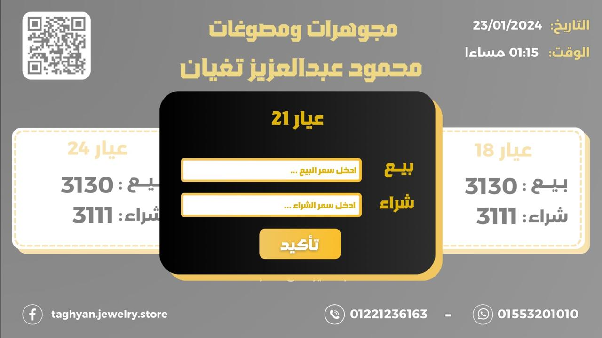

# Taghyan Jewelry Store

The Taghyan Jewelry Store App is a mobile application designed to streamline jewelry browsing, pricing, and inventory management for both users and store owners. The app offers a user-friendly interface where customers can view a range of jewelry products, check real-time prices, and explore detailed product information, while providing store owners with an efficient tool for managing product listings.

### Key Features

- Jewelry Collection Browsing: Allows users to explore a wide variety of jewelry items with high-quality images and detailed descriptions.
- Real-Time Pricing: Displays up-to-date pricing for each product, ensuring users have the latest information.
- Product Management for Store Owners: Admin users can easily add, edit, and manage jewelry items, including descriptions, prices, and images, through a secure backend.
- Secure Admin Panel: Enables store owners to log in securely and access the inventory management system.
- User-Friendly Design: A clean, intuitive UI ensures a seamless browsing experience for customers.

### Technologies Used

- **Flutter:** For building a cross-platform mobile application with a smooth, responsive UI.
- **Firebase:** Provides real-time database capabilities for product listings, user authentication, and secure data management.

### Screenshots

|                            |                            |
| -------------------------- | :------------------------: |
|  |  |

|                            |                            |
| -------------------------- | :------------------------: |
|  |  |

|                            |                            |
| -------------------------- | :------------------------: |
|  |  |
